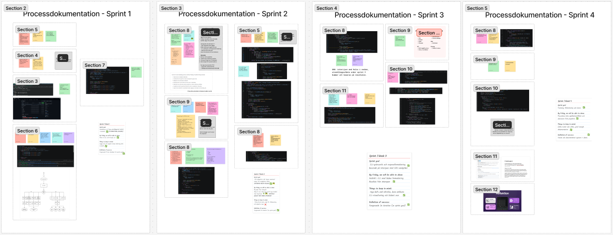
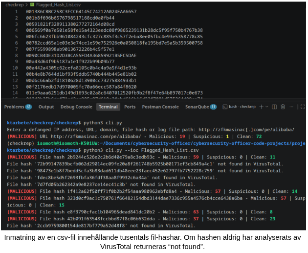

# Projektdokumentation

**checkrep** är ett PoC (_Proof of Concept_) som utforskar automatiseringen av manuella sökningar i SOC-sammanhang genom Python-skripting. Applikationen är en praktisk del av projektarbetet för Cybersecurity Officer, en YH-utbildning från Technigo.

## Projekt och syfte

Under projektet utforskades följande fråga:

_Hur kan undersökningen av indikatorer på kompromettering i en SOC underlättas genom automatisering?_

SOC-analytiker (SOC: _Security Operations Center_) exponeras för hög kognitiv belastning orsakad av bland annat larmtrötthet (alert fatigue) och tidspressat beslutsfattande. Automatisering kan effektivisera vissa uppgifter och därmed minska belastningen.

Att samla in indikatorer på kompromettering (IoC: Indicators of Compromise), utföra manuella sökningar på aggregatorer som VirusTotal och sammanställa resultaten kan vara tidskrävande. I det här projektet har automatiseringen av denna uppgift utforskats i samarbete med analytiker från Volvo SOC.

## Min roll

Projektet har utförts individuellt av mig, Isabel González, under fyra veckor i september 2026. Jag agerade som projektplanerare, forskare, intervjuare och utvecklare.

## Metod och verktyg

Arbetet innefattade individuell forskning och inlärning, intervjuer med analytikerna, samt utvecklingen av en prototyp i form av ett CLI-verktyg (_Command-Line Interface_) med Python, i syfte att tillämpa kunskaper och insikter som förvärvats under projektets gång.

Scrum har använts som agilmetodik vid planering och strukturering av arbetet, som har delats upp i fyra veckolånga sprintar. Metodiken möjliggjorde flexibla anpassningar vid förändringar i tidsplan och omfattning.

Utöver agilmetodiken användes olika verktyg och källor som stöd under projektets gång:

- Figma för projektplanering
- VirusTotalAPI
- Oficiell dokumentation för Python och bibliotek såsom click, ipaddress och requests
- Information om säkerhetsloggning och indikatorer på kompromettering från källor såsom Splunks blogg, Crowdstrike, och Amazon Web Services.

## Resultat

Efter individuell inlärning, forskning, intervjuer med analytiker, och utveckling har _checkrep_ 1.0 slutförts och offentliggjorts. Demos i olika stadier av applikationen har presenterats för Volvo SOC, som har uttryckt intresse för körningen av verktyget i en intern sandlåda när ett närmare samarbete påbörjas.

Se "Usage" i [README](README.md) för en beskrivning av hur applikationen används.

## Lärdomar

### Utveckling

Felsökning under applikationens utveckling var det bästa sättet att förstå Pythons särskilda egenskaper. I början uppstod flera buggar på grund av min tidigare programmeringsvana med TypeScript.

### Samarbete

Den viktigaste lärdomen från samarbetet med Volvo SOC var insikterna kring automation: när den hjälper och inte hjälper. Uppgifter som IoC-sweeps är en bra kandidat för automation, då de innehåller en del repetition och stora mängder data. Däremot innebär SOC-arbetet i en stor organisation en del mänsklig kontakt med domänkunninga personer, vilket inte kan automatiseras helt.

### Tillämpning av tidigare kunskaper

- I början av YH-utbildningen väcktes mitt intresse för SOC-arbete genom övningar där verklighetsnära larm tolkades. I och med min professionell erfarenhet som automationstestare uppstod frågan om hur dessa sökningar kan automatiseras med hjälp av skripting.
- Vissa principer av säker systemutveckling har följts, såsom hantering av hemligheter i en .env-fil, granskning av paket, och aktivering av bransch-skydd-inställningar i GitHub.
- Logiken kring indikatorer på kompromettering har baserats på grundläggande nätverkskunskaper.

## Nästa steg

Se "Future enhancements" och "Upcoming Improvements" i [README](README.md).
